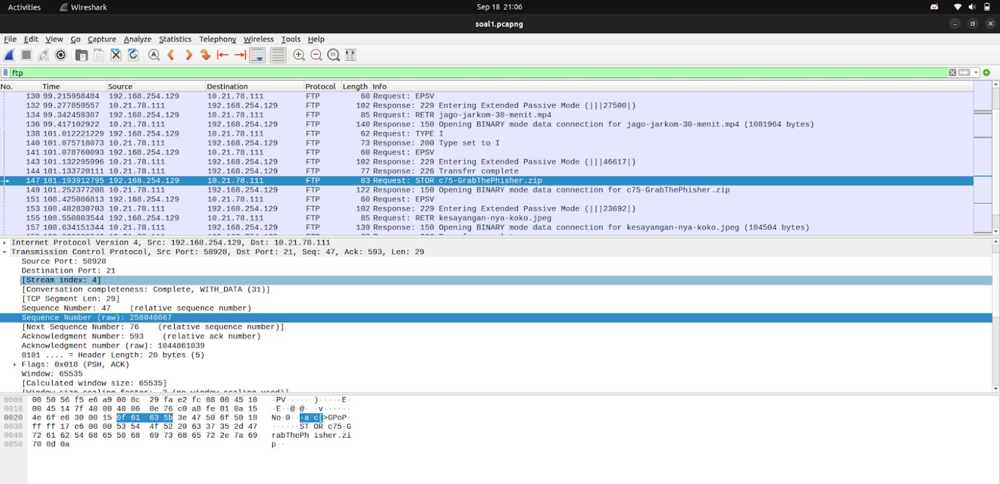
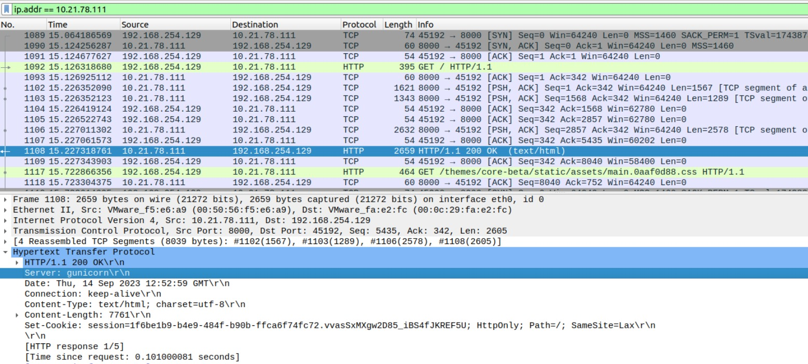
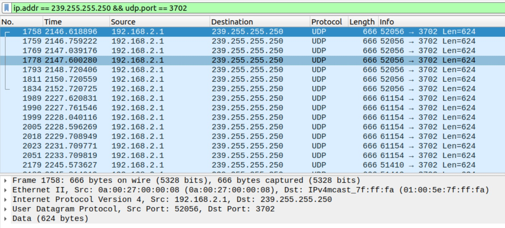
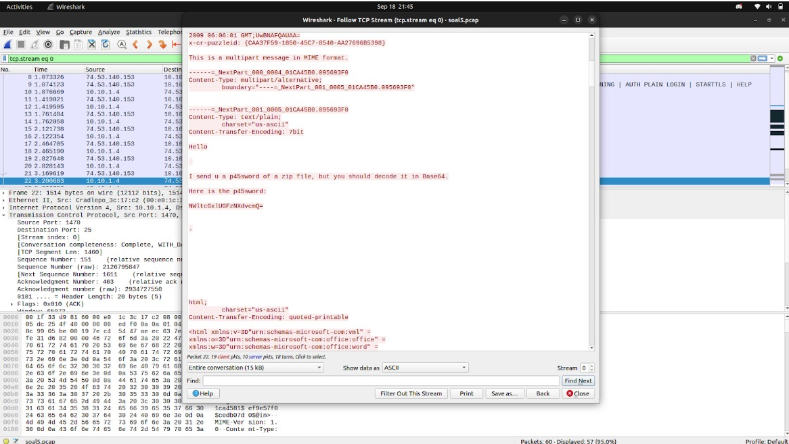
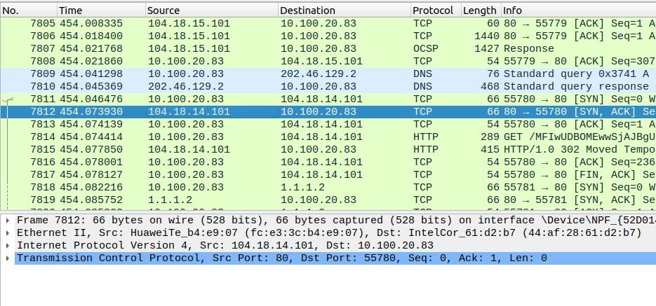
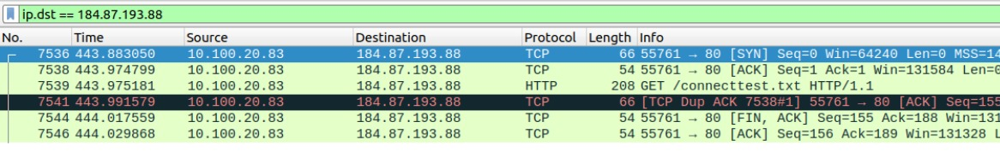
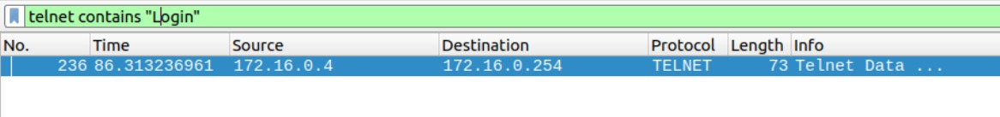
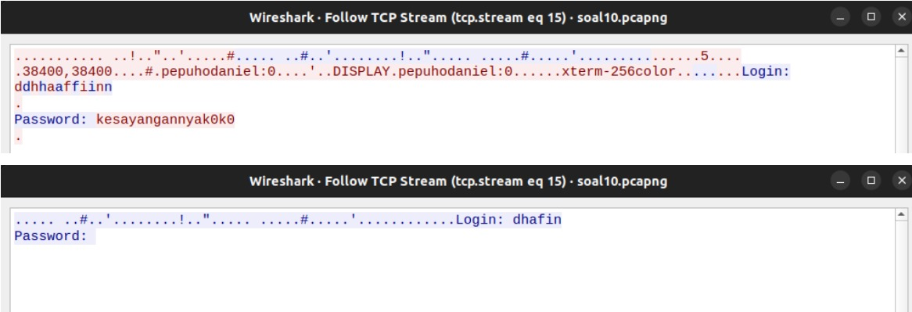

# Jarkom-Modul-1-E18-2023

Anggota Kelompok ''E18'' 
| Nama                      | NRP        |
|---------------------------|------------|
| Hanun Shaka Puspa         | 5025211051 |
| Cholid Junoto             | 5025201038 |

## SOAL 1
User melakukan berbagai aktivitas dengan menggunakan protokol FTP.

### JAWABAN
Dilakukan filtering ftp, kemudian setelah beberapa kali percobaan login, didapatkan user melakukan request dan response untuk file c75-GrabTheFisher.zip. Sequence number dan acknowledgement number didapat pada detail paket bagian TCP untuk paket di screenshot berikut sebagai request dan paket di bawahnya sebagai response

### SCREENSHOT


## SOAL 2
Sebutkan web server yang digunakan pada portal praktikum Jaringan Komputer!

### JAWABAN
Untuk web AJK dengan alamat IP 10.21.78.111, dilakukan filtering dengan perintah ip.addr == 10.21.78.111. Kemudian untuk web servernya, dipilih paket dengan status 200 OK dengan keterangan html sebagai laman web. Didapat web servernya pada detail paket bagian HTTP.

### SCREENSHOT


## SOAL 3
Dapin sedang belajar analisis jaringan. Bantulah Dapin untuk mengerjakan soal berikut:

### JAWABAN
Sesuai soal, dilakukan filtering dengan kueri dan hasil sebagai berikut. Total paket tersebut ada 21 dan transport layer yang digunakan adalah UDP.

### SCREENSHOT


## SOAL 4
Berapa nilai checksum yang didapat dari header pada paket nomor 130?

### JAWABAN
Untuk paket 130, informasi checksum didapat pada detail paket bagian User Datagram Protocol

### SCREENSHOT


## SOAL 5
Elshe menemukan suatu file packet capture yang menarik. Bantulah elshe untuk menganalisis file packet capture tersebut.

### JAWABAN
File pcap untuk soal nomor 5 nampaknya merupakan sebuah rangkaian pesan email dengan attachment file .zip dengan password. Dengan melakukan follow TCP pada paket berisi data email, didapat password yang setelah didekode dengan Base64 didapat 5implePas5word yang dapat digunakan untuk membuka attachment dan diapatkan command nc untuk menjawab soal. Banyak paket dalam file pcap tersebut adalah 60, dengan port server SMTP 25, dan public IP 74.53.140.153.

### SCREENSHOT


## SOAL 6 (REVISI)
PESAN TERSEMBUNYI

Seorang anak bernama Udin Berteman dengan SlameT yang merupakan seorang penggemar film detektif. sebagai teman yang baik, Ia selalu mengajak slamet untuk bermain valoranT bersama. suatu malam, terjadi sebuah hal yang tak terdUga. ketika udin mereka membuka game tersebut, laptop udin menunjukkan sebuah field text dan Sebuah kode Invalid bertuliskan "server SOURCE ADDRESS 7812 is invalid". ketika ditelusuri di google, hasil pencarian hanya menampilkan a1 e5 u21. jiwa detektif slamet pun bergejolak. bantulah udin dan slamet untuk menemukan solusi kode error tersebut.

nc 10.21.78.111 6666
View Hint
Clue 1: Sepertinya ada yang salah dengan penulisan tersebut secara KBBI. Ada sesuatu yang Besar di depan mata.

View Hint
Jenis cipher merupakan substitusi a1z26 Cipher

View Hint
Rentang Huruf yang digunakan Huruf A-R, 1-18 dengan Jawaban 6 Huruf.

View Hint
SOURCE ADDRESS ADALAH KUNCI SEMUANYA.

### JAWABAN
Dari file pcap yang diberikan, dicari source address dari paket nomor 7812 dan didapat ```104.18.14.101```. Sesuai clue yang diberikan, dilakukan decipher dengan substitusi A1Z26 dan didapat kode ```JDRNJA```.

### SCREENSHOT


## SOAL 7
Berapa jumlah packet yang menuju IP 184.87.193.88?

### JAWABAN
Dilakukan filter dengan kueri ip.dst == 184.87.193.88 dan didapat paket sejumlah 6

### SCREENSHOT


## SOAL 8
Berikan kueri filter sehingga wireshark hanya mengambil semua protokol paket yang menuju port 80! (Jika terdapat lebih dari 1 port, maka urutkan sesuai dengan abjad)!

### JAWABAN
Sesuai abjad, maka kueri dilakukan pada tcp sebelum udp. Untuk port menuju 80 maka tcp.dstport == 80 dan udp.dstport == 80. Variasi untuk jawaban ini dapat berupa “tcp.dstport == 80 or udp.dstport == 80”, namun jawaban yang diterima adalah tcp.dstport == 80 || udp.dstport == 80

## SOAL 9
Berikan kueri filter sehingga wireshark hanya mengambil paket yang berasal dari alamat 10.51.40.1 tetapi tidak menuju ke alamat 10.39.55.34!

### JAWABAN
Variasi dari kueri soal ini adalah ip.src == 10.51.40.1 and ip.dst != 10.39.55.34, atau ip.dst != 10.39.55.34 && ip.src == 10.51.40.1, atau ip.dst != 10.39.55.34 and ip.src == 10.51.40.1, namun jawaban yang diterima adalah ip.src == 10.51.40.1 && ip.dst != 10.39.55.34

## SOAL 10
Sebutkan kredensial yang benar ketika user mencoba login menggunakan Telnet!

### JAWABAN
Dilakukan filtering dengan kueri => telnet contains “Login”. Kemudian dilakukan follow TCP. Dari konfigurasi entire conversations didapat password dan dari 172.16.0.4:23 -> 172.16.0.254:43964 didapat kredensial username

### SCREENSHOT



